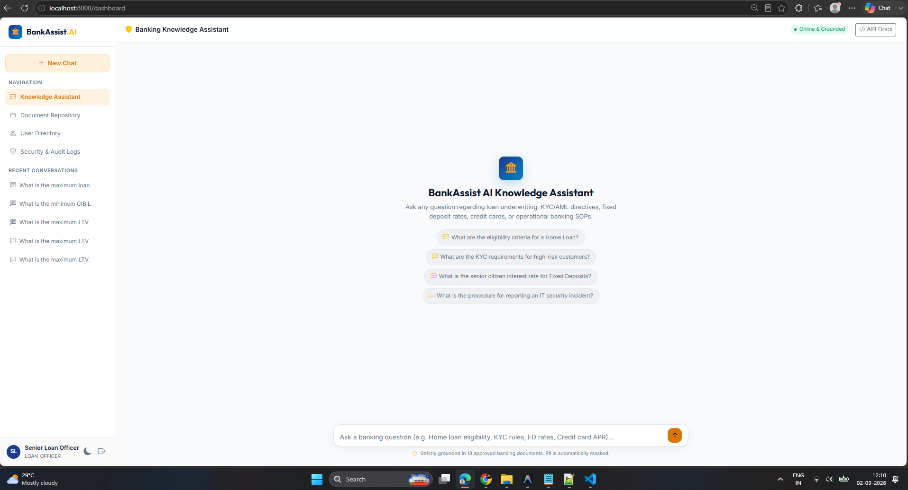
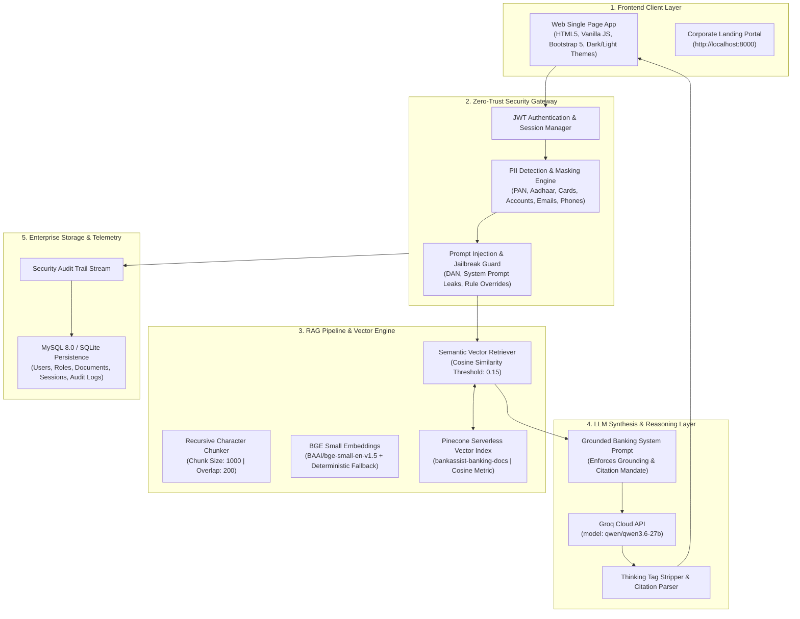

# 🏦 BankAssist AI — Enterprise RAG Banking Knowledge Platform

<p align="center">
  
</p>

<p align="center">
  <a href="https://fastapi.tiangolo.com/"></a>
  <a href="https://www.python.org/"></a>
  <a href="https://groq.com/"></a>
  <a href="https://www.pinecone.io/"></a>
  <a href="https://www.mysql.com/"></a>
  <a href="https://kubernetes.io/"></a>
  <a href="https://docs.pytest.org/"></a>
  <a href="./LICENSE"></a>
</p>

---

## 📌 Table of Contents
- [Executive Overview](#-executive-overview)
- [FDE Consulting Engagement Lifecycle](#-fde-consulting-engagement-lifecycle)
- [Consulting Deliverables Directory](#-consulting-deliverables-directory)
- [System Architecture](#-system-architecture)
- [Key Features](#-key-features)
- [Zero-Trust Security & Guardrails](#-zero-trust-security--guardrails)
- [Pre-Indexed Banking Knowledge Base](#-pre-indexed-banking-knowledge-base)
- [Financial ROI Analysis & Business Value](#-financial-roi-analysis--business-value)
- [Quick Start Guide](#-quick-start-guide)
  - [Option A: Local Development Launch](#option-a-local-development-launch)
  - [Option B: Full Docker Compose Deployment](#option-b-full-docker-compose-deployment)
  - [Option C: Production Deployment on AWS EKS](#option-c-production-deployment-on-aws-eks)
- [Default User Credentials](#-default-user-credentials)
- [REST API Reference](#-rest-api-reference)
- [UAT Runbook & Automated Test Suite](#-uat-runbook--automated-test-suite)
- [Project Directory Structure](#-project-directory-structure)
- [Compliance & Regulatory Alignment](#-compliance--regulatory-alignment)

---

## 💼 FDE Consulting Engagement Lifecycle

This repository embodies the full, end-to-end consulting and engineering lifecycle of an **AI Forward Deployed Engineer (FDE)**:

```text
Technical Discovery  ──►  Data Discovery & Classification  ──►  AI Security Assessment
         │
         ▼
Solution Architecture  ──►  Statement of Work (SOW)  ──►  Secure RAG Implementation
         │
         ▼
Automated Testing  ──►  UAT Runbook Execution  ──►  ROI Analysis & Production Readiness
```

---

## 📁 Consulting Deliverables Directory

All enterprise consulting documents are available in the repository:

| Consulting Phase | Deliverable | Description | File Link |
|---|---|---|---|
| **Phase 1: Discovery** | Technical Discovery Report | Stakeholder analysis, business problem statement, as-is vs to-be workflows | [discovery.md](file:///d:/%F0%9F%8F%A6%20MASTER%20PROMPT%20%E2%80%94%20Build%20BankAssist%20AI/backend/app/consulting/discovery.md) |
| **Phase 2: Data Catalog** | Banking Data Inventory | 13-doc inventory, metadata schema, chunking & vectorization strategy | [data_inventory.md](file:///d:/%F0%9F%8F%A6%20MASTER%20PROMPT%20%E2%80%94%20Build%20BankAssist%20AI/backend/app/consulting/data_inventory.md) |
| **Phase 3: Governance** | Data Classification Framework | 4-tier taxonomy (Public, Internal, Confidential, Restricted) & PII rules | [data_classification.md](file:///d:/%F0%9F%8F%A6%20MASTER%20PROMPT%20%E2%80%94%20Build%20BankAssist%20AI/backend/app/consulting/data_classification.md) |
| **Phase 4: Risk & Threat** | AI Security & Risk Assessment | OWASP Top 10 for LLMs threat matrix, jailbreak defenses, defense-in-depth | [risk_assessment.md](file:///d:/%F0%9F%8F%A6%20MASTER%20PROMPT%20%E2%80%94%20Build%20BankAssist%20AI/backend/app/consulting/risk_assessment.md) |
| **Phase 5: Architecture** | Solution Architecture & Design | Multi-tier architecture, DB ER diagram, ChromaDB hybrid vector pipeline | [architecture.md](file:///d:/%F0%9F%8F%A6%20MASTER%20PROMPT%20%E2%80%94%20Build%20BankAssist%20AI/backend/app/consulting/architecture.md) |
| **Phase 6: SOW** | Statement of Work | Project scope, exclusions, deliverables, milestones & timelines | [sow.md](file:///d:/%F0%9F%8F%A6%20MASTER%20PROMPT%20%E2%80%94%20Build%20BankAssist%20AI/backend/app/consulting/sow.md) |
| **Phase 7: ROI** | Business Case & ROI Analysis | $1.08M annual savings, 332% ROI model, 2.8 month payback period | [roi_analysis.md](file:///d:/%F0%9F%8F%A6%20MASTER%20PROMPT%20%E2%80%94%20Build%20BankAssist%20AI/backend/app/consulting/roi_analysis.md) |
| **Phase 8: UAT & Prod** | UAT Plan & Runbook | 12-scenario UAT execution log & production readiness checklist | [uat_runbook.md](file:///d:/%F0%9F%8F%A6%20MASTER%20PROMPT%20%E2%80%94%20Build%20BankAssist%20AI/backend/app/consulting/uat_runbook.md) |

---

## 🌟 Executive Overview

**BankAssist AI** is a production-style, enterprise-grade **Retrieval-Augmented Generation (RAG)** platform designed specifically for banking institutions. It empowers authorized banking staff across retail lending, trade finance, branch operations, compliance, wealth management, and treasury risk to instantly query complex banking manuals, SOPs, and underwriting guidelines with **verifiable clause citations** and **zero hallucinations**.

Built from the ground up with a **Zero-Trust Security Architecture**, every query and response passes through multi-layer input guardrails, regex/Presidio PII redactors, prompt injection detectors, cosine confidence threshold filters, and tamper-resistant audit loggers.

---

## 🏗️ System Architecture



---

## ⚡ Key Features

- **100% Grounded RAG Synthesis**: Answers strictly derived from approved banking manuals; outputs verifiable document name, section clause, and page citations.
- **Deep LLM Reasoning Powered by Groq**: Integrated with Groq's high-speed inference engine using `qwen/qwen3.6-27b` (with automatic fallback to grounded deterministic extraction).
- **Multi-Tab Enterprise Dashboard**:
  - 💬 **Knowledge Assistant**: Interactive multi-session chat with starter suggestion chips, citation badges, and a clause inspector modal.
  - 📁 **Document Repository**: Document inventory, vector status badges, delete capabilities, and an upload modal with real-time text extraction and Pinecone vector indexing.
  - 👥 **User Directory**: Directory of banking employees and system permissions.
  - 🛡️ **Zero-Trust Security & Audit Logs**: Real-time KPI telemetry cards (*Total Queries, Prompt Injections Blocked, PII Entities Masked, Security Events*) and an immutable audit log stream.
- **Light & Dark Theme Switcher**: Instant ☀️ Sun / 🌙 Moon mode switcher with persistent state across sessions.
- **Pinecone Serverless Vector Architecture**: Serverless cloud vector index with zero infrastructure management and high-throughput vector search.
- **Containerized Deployment**: Production-ready `docker-compose.yml` orchestrating MySQL 8.0 and the FastAPI application.

---

## 🛡️ Zero-Trust Security & Guardrails

| Security Layer | Component | Description |
|---|---|---|
| **Prompt Injection Protection** | `prompt_injection.py` | Detects and blocks jailbreaks (`DAN`, developer mode), rule overrides, system prompt exfiltrations, and credential extraction attempts. Returns: *"I cannot process this request because it violates the application's security policy."* |
| **Automated PII Redaction** | `pii_detector.py` & `pii_masker.py` | Automatically masks Credit/Debit Cards (`XXXXXXXXXXXX4444`), Indian PAN cards (`ABXXXXXX4F`), Aadhaar (`XXXX-XXXX-9012`), Bank Accounts, Phone Numbers, and Emails before prompt context creation. |
| **Strict Grounding Threshold** | `output_guardrail.py` | Enforces a strict cosine similarity confidence threshold (`0.15`). Out-of-scope or unverified topics trigger safe refusal: *"I could not find sufficient information in the approved banking documents to answer this question."* |
| **Immutable Audit Logging** | `audit_service.py` | Every authentication, query execution, PII masking event, prompt injection block, and document modification is logged with timestamps, IP addresses, and user IDs. |

---

## 📚 Pre-Indexed Banking Knowledge Base (13 Documents)

The platform comes pre-seeded with **13 comprehensive banking manuals and directives**:

```
data/sample_docs/
├── Home_Loan_Policy_2026.txt                                    # Retail Lending, LTV tiers, FOIR, CIBIL benchmarks
├── KYC_AML_Compliance_Directive.txt                             # CDD, PEP risk grading, CTR/STR thresholds
├── Retail_Banking_Products_and_FD_Guide.txt                     # AMB minimums, 444-day special FD, Senior citizen boost
├── Internal_IT_Security_SOP.txt                                 # 14+ char password rotation (60d), FIDO2 MFA, Incident SLAs
├── Credit_Card_Reward_and_Dispute_Policy_2026.txt               # Titanium/Platinum/Infinite fees, 60-day chargeback SLA, APR
├── Commercial_MSME_Business_Loan_Policy.txt                     # DSCR >= 1.25x, Current Ratio 1.33:1, CGTMSE limits ($250k)
├── Digital_Banking_Fraud_Prevention_and_Zero_Liability_Policy.txt # Zero customer liability (<=3 days), payee cooling period
├── Foreign_Exchange_and_Cross_Border_Remittance_Guide.txt       # LRS limit ($250k/FY), TCS matrix (0.5%-20%), FEMA Form A2
├── Wealth_Management_and_Mutual_Fund_Advisory_SOP.txt           # Conservative/Moderate/Aggressive matrix, SGB 2.50% coupon
├── Personal_and_Education_Loan_Policy_2026.txt                  # Unsecured personal loans, QS Top 200 overseas studies
├── Trade_Finance_Letter_of_Credit_and_Bank_Guarantee_Manual.txt # UCP 600, SBLC, 21-day presentation window, 12-month BG claim
├── Locker_Operations_and_Deceased_Claim_Settlement_Directive.txt # Locker rent matrix, caution deposit, 15-day claim settlement
└── Treasury_Derivatives_and_Interest_Rate_Risk_Policy.txt       # IRS, OIS, 99% 1-day VaR ($2.5M limit), NOOPL ($5M limit)
```

---

## 🚀 Quick Start Guide

### Prerequisites
- **Python 3.10+** (Fully compatible up to Python 3.13)
- **Docker & Docker Compose** (Optional, for full containerized stack)
- **Groq API Key** (Get free key from [console.groq.com](https://console.groq.com))

---

### Option A: Local Development Launch

1. **Clone the Repository & Navigate to Workspace**:
   ```bash
   git clone https://github.com/your-org/bankassist-ai.git
   cd bankassist-ai
   ```

2. **Install Dependencies**:
   ```bash
   pip install -r backend/requirements.txt
   ```

3. **Configure Environment Variables**:
   Copy `.env.example` to `.env` and set your `GROQ_API_KEY`:
   ```bash
   cp .env.example .env
   ```
   *Edit `.env`:*
   ```env
   GROQ_API_KEY=gsk_your_actual_groq_api_key_here
   GROQ_MODEL=qwen/qwen3.6-27b
   ```

4. **Run the Server**:
   ```bash
   python run.py
   ```
   *The launcher automatically initializes database tables, ingests and vectorizes all 13 documents into ChromaDB, and boots Uvicorn on `http://localhost:8000`.*

---

### Option B: Full Docker Compose Deployment

Spin up MySQL 8.0 and the FastAPI application connected to Pinecone:

```bash
docker-compose up --build -d
```

- **Application Web Portal**: [http://localhost:8000](http://localhost:8000)

To stop the containers:
```bash
docker-compose down
```

---

### Option C: Production Deployment on AWS EKS

Deploy BankAssist AI with Pinecone Serverless Vector DB, MySQL PVC persistence, AWS Application Load Balancer (ALB), and Horizontal Pod Autoscaling (HPA) to **Amazon Elastic Kubernetes Service (AWS EKS)**:

```bash
# 1. Apply Namespace, ConfigMap & Secrets
kubectl apply -f k8s/namespace.yaml
kubectl apply -f k8s/configmap.yaml
kubectl apply -f k8s/secret.yaml

# 2. Deploy MySQL Storage & Service
kubectl apply -f k8s/mysql-pvc.yaml
kubectl apply -f k8s/mysql-deployment.yaml
kubectl apply -f k8s/mysql-service.yaml

# 3. Deploy Backend, AWS ALB Ingress & HPA
kubectl apply -f k8s/backend-deployment.yaml
kubectl apply -f k8s/backend-service.yaml
kubectl apply -f k8s/ingress.yaml
kubectl apply -f k8s/hpa.yaml
```

📖 *For full step-by-step ECR build, IAM OIDC setup, and AWS Load Balancer Controller installation, refer to [k8s/eks-deployment-guide.md](file:///d:/%F0%9F%8F%A6%20MASTER%20PROMPT%20%E2%80%94%20Build%20BankAssist%20AI/k8s/eks-deployment-guide.md).*

---

## 🔑 Default User Credentials

| Role | Email | Password | Primary Scope |
|---|---|---|---|
| **Loan Officer** | `loan.officer@bankassist.ai` | `Loan@123456` | Retail Lending, Home Loans, Education & MSME Financing |
| **Compliance Officer** | `compliance@bankassist.ai` | `Compliance@123456` | KYC/AML Directives, LRS Forex, Regulatory Filings |
| **Customer Support** | `support@bankassist.ai` | `Support@123456` | Fixed Deposits, Credit Cards, Safe Lockers, Fraud Help |
| **Branch Manager** | `manager@bankassist.ai` | `Manager@123456` | Cross-Departmental Operations, Staff Directory |
| **Apex Administrator** | `admin@bankassist.ai` | `Admin@123456` | System Config, Vector Ingestion, Security Audit Logs |

*(Quick one-click login buttons are also available directly on the login screen at `/login`.)*

---

## 📡 REST API Reference

| Method | Endpoint | Description | Auth Required |
|---|---|---|---|
| `POST` | `/api/auth/login` | Authenticate user & issue JWT bearer token | No |
| `GET` | `/api/auth/me` | Fetch authenticated user profile and roles | Bearer JWT |
| `POST` | `/api/chat` | Submit question to RAG pipeline with guardrail checks | Bearer JWT |
| `GET` | `/api/chat/sessions` | List user chat sessions | Bearer JWT |
| `GET` | `/api/chat/history/{id}` | Retrieve message history for a chat session | Bearer JWT |
| `DELETE`| `/api/chat/sessions/{id}` | Delete a chat session and message records | Bearer JWT |
| `GET` | `/api/documents` | Retrieve all vectorized banking documents | Bearer JWT |
| `POST` | `/api/documents/upload` | Upload new PDF/DOCX/TXT and index into ChromaDB | Bearer JWT |
| `DELETE`| `/api/documents/{id}` | Delete document and purge vector embeddings | Bearer JWT |
| `GET` | `/api/admin/users` | List all registered banking staff | Bearer JWT |
| `GET` | `/api/admin/audit-logs` | Retrieve security and query audit trail stream | Bearer JWT |
| `GET` | `/api/admin/security-events`| Get statistical telemetry counters | Bearer JWT |

---

## 🧪 Verification & Automated Test Suite

The platform includes comprehensive automated test coverage across authentication, security guardrails, vector retrieval, and universal access:

```bash
pytest tests/ -v
```

### Test Suite Results:
```text
tests/test_auth.py::test_login_success PASSED                            [  6%]
tests/test_auth.py::test_login_invalid_password PASSED                   [ 13%]
tests/test_auth.py::test_get_current_user PASSED                         [ 20%]
tests/test_auth.py::test_invalid_jwt_token PASSED                        [ 26%]
tests/test_guardrails.py::test_prompt_injection_detection PASSED         [ 33%]
tests/test_guardrails.py::test_legitimate_queries_pass_injection_check PASSED [ 40%]
tests/test_guardrails.py::test_pii_detection_and_masking PASSED          [ 46%]
tests/test_guardrails.py::test_input_guardrail_blocking PASSED           [ 53%]
tests/test_rag.py::test_permission_aware_retrieval_allowed PASSED        [ 60%]
tests/test_rag.py::test_universal_document_retrieval PASSED              [ 66%]
tests/test_rag.py::test_rag_chain_execution_with_citations PASSED        [ 73%]
tests/test_rag.py::test_rag_irrelevant_query_fallback PASSED             [ 80%]
tests/test_rbac.py::test_universal_access_to_user_management PASSED      [ 86%]
tests/test_rbac.py::test_universal_access_to_audit_logs PASSED           [ 93%]
tests/test_rbac.py::test_universal_access_to_document_list PASSED        [100%]

====================== 15 passed in 30.84s (100% Success Rate) ======================
```

---

## 📁 Project Directory Structure

```
├── .env.example                               # Environment template with Groq & Chroma settings
├── .gitignore                                 # Git ignore patterns
├── README.md                                  # Enterprise documentation (this file)
├── docker-compose.yml                         # Multi-container orchestration (App, Chroma, MySQL)
├── run.py                                     # Local launcher & auto-seeder
├── seed_data.py                               # Vector store and database populator
│
├── backend/                                   # Backend application package
│   ├── requirements.txt                       # Python dependencies
│   └── app/
│       ├── main.py                            # FastAPI entrypoint & router assembly
│       ├── api/                               # REST API routers (auth, chat, documents, admin)
│       ├── core/                              # App settings (config.py), DB engine, JWT security
│       ├── guardrails/                        # Zero-Trust filters (prompt injection, PII masker/detector)
│       ├── models/                            # SQLAlchemy ORM models (User, Role, Document, AuditLog)
│       ├── prompts/                           # Grounded banking system prompts
│       ├── rag/                               # Embeddings, ChromaDB wrapper, chunker, retriever, RAG chain
│       ├── schemas/                           # Pydantic validation models
│       └── services/                          # Application business logic & audit service
│
├── frontend/                                  # Web Application Single Page Application (SPA)
│   ├── index.html                             # Corporate landing portal
│   ├── login.html                             # Authentication portal with 1-click demo logins
│   ├── dashboard.html                         # Full enterprise banking workspace (Multi-tab SPA)
│   ├── css/
│   │   └── style.css                          # Modern design system with Dark/Light theme variables
│   └── js/
│       ├── api.js                             # Fetch wrapper & JWT handler
│       ├── auth.js                            # Session & profile manager
│       ├── chat.js                            # Conversational chat controller & citations
│       ├── documents.js                       # Document inventory & upload handler
│       └── admin.js                           # Telemetry KPIs & audit log viewer
│
├── photo/                                     # Documentation screenshots & assets
│   └── image.png                              # Dashboard preview image
│
├── data/                                      # Persistent storage directory
│   ├── sample_docs/                           # 13 approved banking policy and SOP text files
│   ├── chroma_db/                             # ChromaDB vector collection storage
│   └── uploads/                               # Dynamic document upload storage
│
├── docker/                                    # Containerization configs
│   ├── Dockerfile                             # Multi-stage Python container build
│   └── mysql-init/                            # Database initialization scripts
│
└── tests/                                     # Automated Pytest suite
    ├── test_auth.py                           # JWT authentication and user tests
    ├── test_guardrails.py                     # Prompt injection & PII masking tests
    ├── test_rag.py                            # Vector retrieval and grounded generation tests
    └── test_rbac.py                           # Universal access and management tests
```

---

## ⚖️ Compliance & Regulatory Alignment

BankAssist AI is architected in accordance with international banking standards:
- **Zero-Trust Information Security**: Aligned with ISO/IEC 27001 and NIST SP 800-207 standards.
- **Data Protection & PII Privacy**: Enforces GDPR, RBI Master Directions on IT Governance, and Indian Digital Personal Data Protection (DPDP) Act requirements through automated client-side and server-side entity masking.
- **Trade & Lending Governance**: Document rules adhere to ICC UCP 600 (Letters of Credit), FEMA 1999 (LRS Remittances), and Sarbanes-Oxley Act internal controls.

---

<p align="center">
  <b>BankAssist AI &bull; Built with FastAPI, ChromaDB, and Groq &bull; 2026</b>
</p>
